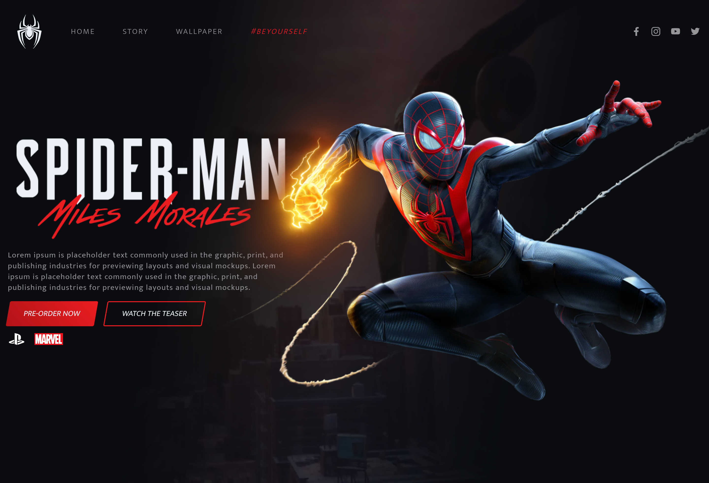

# spiderman

Front-end estático utilizando motiondesign, deselvolvido durante a frontweek.

#html #css #sass #scss #motiondesign

### Bibliotecas:

:books: [TiltJS](https://gijsroge.github.io/tilt.js/)

:books: [GSAP - GreenSock](https://greensock.com/gsap/)

version 2 -> TweenMax

 

  

